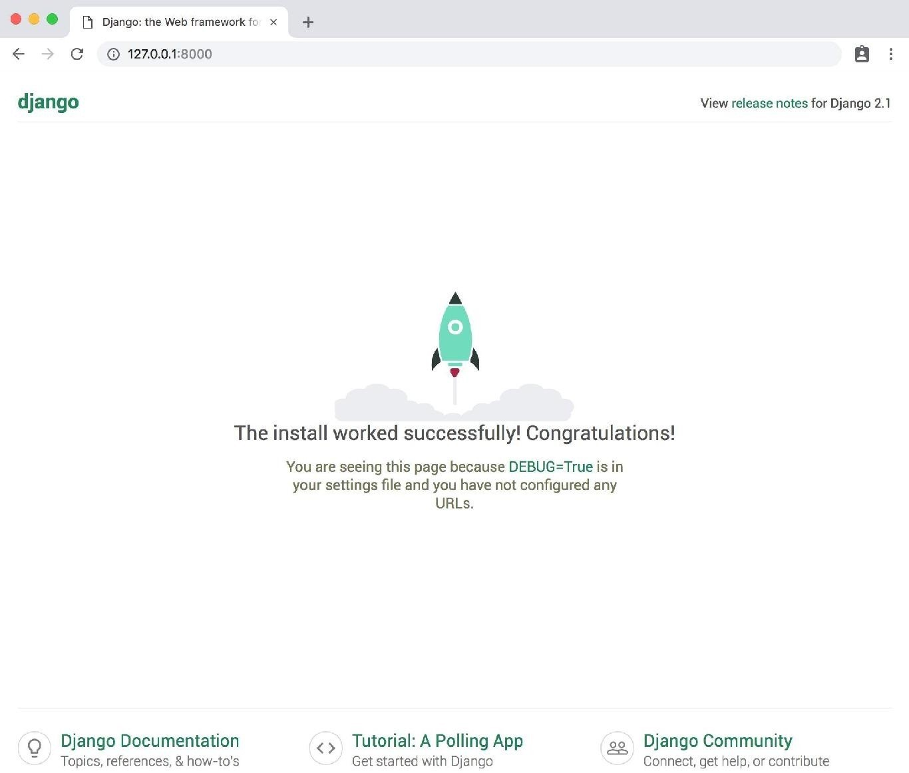
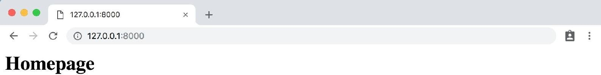
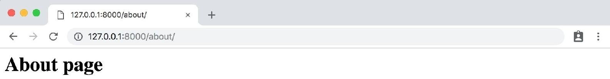
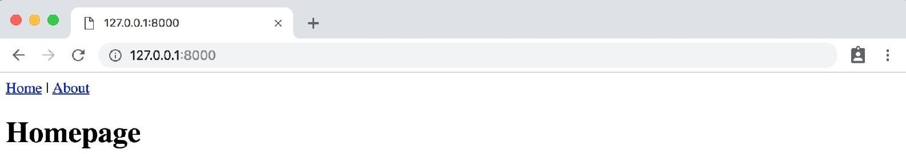
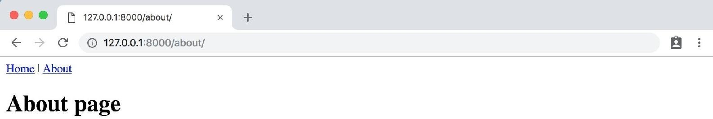

# Pages app

In this field you will build, test and deploy a Pages app that has a homepage and an about pagge. You will also learn about Django's class-based views and templates.

## Initial Set Up

Initial set up involves the following steps:

 - create a new directory for our code
 - install Django in a new virtual environment
 - create a new Django project
 - create a new pages app
 - update settings.py

```bash
cd ~/Desktop
mkdir django_pagesapp
cd django_pagesapp
pipenv install django==2.1 '''or if you have default python2.7 in system, you can use ''' pipenv --python 3 install django==2.1
pipenv shell
(django_pagesapp) $ django-admin startproject pages_project .
(django_pagesapp) $ python manage.py startapp pages
```

Open your text editor and navigate to the file *settings.py*. Add the *pages* app at the bottom of your project under *INSTALLED_APPS*

```python
# pages_project/settings.py
INSTALLED_APPS = [
'django.contrib.admin',
'django.contrib.auth',
'django.contrib.contenttypes',
'django.contrib.sessions',
'django.contrib.messages',
'django.contrib.staticfiles',
'pages.apps.PagesConfig', # new
```

Start the local web server with *runserver*.

```bash
(django_pagesapp) $ python manage.py runserver
```

And then navigate to http://127.0.0.1:8000/.


<p style="text-align: center; font-weight: bold;">Django welcome page</p>

## Templates

Every web framework needs a convenient way to generate HTML files. In Django, the approach is to use templates so that individual HTML files can be served by a view to a web page specified by the URL.

It’s worth repeating this pattern since you’ll see it over and over again in Django development: Templates, Views, and URLs. The order in which you create them doesn’t much matter since all three are required and work closely together. The URLs control the initial route, the entry point into a page, such as /about, the views contain the logic or the “what”, and the template has the HTML. For web pages that rely on a database model, it is the view that does much of the work to decide what data is available to the template.

So: Templates, Views, URLs. This pattern will hold true for **every Django web page you make**. However it will take some repetition before you internalize it.

Ok, moving on. The question of where to place the templates directory can be confusing for django users. By default, Django looks within each app for templates. In your pages app it will expect a home.html template to be located in the following location:

Layout
```bash
└── pages
	├── templates
		├── pages
			├── home.html
```	

This means you would need to create a new templates directory, a new directory with the name of the app, *pages*, and finally our template itself which is *home.html*.

A common question is: Why this repetitive structure? The short answer is that the Django template loader wants to be really sure it find the correct template and this is how it’s programmed to look for them.

Fortunately there’s another often-used approach to structuring the templates in a Django project. And that is to instead create a single, project-level templates directory that is available to all apps. This is the approach you’ll use. By making a small tweak to our settings.py file you can tell Django to also look in this project-level folder for templates.

First quit your server with *Control+c*. Then create a project-level folder called templates and an HTML file called *home.html*.

```bash
(django_pagesapp) $ mkdir templates
(django_pagesapp) $ touch templates/home.html
```

Next you need to update *settings.py* to tell Django to look at the project-level for *templates*. This is a one-line change to the setting *'DIRS'* under *TEMPLATES*.

```python
# pages_project/settings.py
TEMPLATES = [
{
...
'DIRS': [os.path.join(BASE_DIR, 'templates')], # new
...
},
]
```

Then you can add a simple headline to your *home.html* file.

```html
<!-- templates/home.html -->
<h1>Homepage</h1>
```

Ok, template is complete! The next step is to configure URL and view.

## Class-Based Views

Early versions of Django only shipped with function-based views, but developers soon found themselves repeating the same patterns over and over again. Write a view that lists all objects in a model. Write a view that displays only one detailed item from a model. And so on.

Function-based generic views were introduced to abstract these patterns and streamline development of common patterns. However there was [no easy way to extend or customize these views.](https://docs.djangoproject.com/en/3.0/topics/class-based-views/intro/) As a result, Django introduced class-based generic views that make it easy to use and also extend views covering common use cases.

In this view the [built-in TemplateView](https://docs.djangoproject.com/en/3.0/topics/class-based-views/generic-display/) use to display for template. Update the *pages/views.py* file.

```python
# pages/views.py
from django.views.generic import TemplateView

class HomePageView(TemplateView):
	template_name = 'home.html'
```

## URLs

The last step is to update URLConfs. First you update the project-level urls.py file to point at your pages app and then within pages you match the views to routes.

```python
# pages_project/urls.py
from django.contrib import admin
from django.urls import path, include # new

urlpatterns = [
	path('admin/', admin.site.urls),
	path('', include('pages.urls')), # new
]
```

The code here should be review at this point. You add include on the second line to point the existing URL to the pages app. Next create an app-level urls.py file.

```bash
(django_pagesapp) $ touch pages/urls.py
```

And add the following code.

```python
# pages/urls.py
from django.urls import path
from .views import HomePageView

urlpatterns = [
	path('', HomePageView.as_view(), name='home'),
]
```

If you start up the web server with *python manage.py runserver* and navigate to http://127.0.0.1:8000/ you can see our new homepage.


<p style="text-align: center; font-weight: bold;">Homepage</p>

## Add an About Page

The process for adding an about page is very similar to what you just did. You’ll create a new template file, a new view, and a new url route.

```bash
(django_pagesapp) $ touch templates/about.html
```

Then populate it with a short HTML headline.

```html
<!-- templates/about.html -->
<h1>About page</h1>
```

Create a new view for the page.

```python
# pages/views.py
from django.views.generic import TemplateView

class HomePageView(TemplateView):
	template_name = 'home.html'

class AboutPageView(TemplateView):
	template_name = 'about.html'
```

And then connect it to a URL at about/.

```python
# pages/urls.py
from django.urls import path

from .views import HomePageView, AboutPageView # new

urlpatterns = [
	path('about/', AboutPageView.as_view(), name='about'), # new
	path('', HomePageView.as_view(), name='home'),
]
```
Start up the web server with *python manage.py runserver*.

Navigate to http://127.0.0.1:8000/about and you can see our new “About page”.


<p style="text-align: center; font-weight: bold;">About page</p>

## Extending Templates

The real power of templates is their ability to be extended. If you think about most web sites, there is content that is repeated on every page (header, footer, etc). Wouldn’t it be nice if we, as developers, could have one canonical place for your header code that would be inherited by all other templates?

Well we can! Let’s create a base.html file containing a header with links to your two pages. You could name this file anything but using base.html is a common convention. 

```bash
(django_pagesapp) $ touch templates/base.html
```

Django has a minimal templating language for adding links and basic logic in your templates. You can see the full list of built-in template tags here in the official docs. Template tags take the form of  where the “something” is the template tag itself. You can even create your own custom template tags, though you won’t do that in this book.

To add URL links in your project you can use the built-in url template tag which takes the URL pattern name as an argument. Remember how you added optional URL names to your url routers? This is why. The url tag uses these names to automatically create links for us.

The URL route for your homepage is called home therefore to configure a link to it you would use the following: .

```html
<!-- templates/base.html -->
<header>
	<a href="">Home</a> | <a href="">About</a>
</header>



```
At the bottom you’ve added a block tag called content. Blocks can be overwritten by child templates via inheritance. While it’s optional to name your closing endblock–you can just write  if you prefer–doing so helps with readability, especially in larger template files.

Let’s update your home.html and about.html to extend the base.html template. That means you can reuse the same code from one template in another template. The Django templating language comes with an extends method that you can use for this.

```html
<!-- templates/home.html -->



<h1>Homepage</h1>

```

```html
<!-- templates/about.html -->



<h1>About page</h1>

```

Now if you start up the server with *python manage.py runserver* and open up your webpages again at http://127.0.0.1:8000/ and http://127.0.0.1:8000/about you’ll see the header is magically included in both locations.


<p style="text-align: center; font-weight: bold;">Homepage with header</p>


<p style="text-align: center; font-weight: bold;">About page with header</p>

## Tests

Even in an application this basic, it’s important to add tests and get in the habit of always adding them to your Django projects. In the words of [Jacob Kaplan-Moss](https://jacobian.org/), one of Django’s original creators, “Code without tests is broken as designed.”

Writing tests is important because it automates the process of confirming that the code works as expected. In an app like this one, you can manually look and see that the home page and about page exist and contain the intended content. But as a Django project grows in size there can be hundreds if not thousands of individual web pages and the idea of manually going through each page is not possible. Further, whenever you make changes to the code–adding new features, updating existing ones, deleting unused areas of the site–we want to be sure that you have not inadvertently broken some other piece of the site. Automated tests let us write one time how you expect a specific piece of your project to behave and then let the computer do the checking for us.

Fortunately Django comes with robust, built-in testing tools for writing and running tests.

If you look within your pages app, Django already provided a tests.py file you can use. Open it and add the following code:

```python
# pages/tests.py
from django.test import SimpleTestCase

class SimpleTests(SimpleTestCase):
	def test_home_page_status_code(self):
	response = self.client.get('/')
	self.assertEqual(response.status_code, 200)

	def test_about_page_status_code(self):
	response = self.client.get('/about/')
	self.assertEqual(response.status_code, 200)
```
We’re using SimpleTestCase here since we aren’t using a database. If we were using a database, we’d instead use TestCase. Then we perform a check if the status code for each page is 200, which is the standard response for a successful HTTP request. That’s a fancy way of saying it ensures that a given webpage actually exists, but says nothing about the content of said page.

To run the tests quit the server Control+c and type *python manage.py test* on the command line:

```bash
(django_pagesapp) $ python manage.py test
Creating test database for alias 'default'...
System check identified no issues (0 silenced).
..
----------------------------------------------------------------------
Ran 2 tests in 0.014s

OK
Destroying test database for alias 'default'...
```
Success! You’ll do much more with testing in the future, especially once you start working with databases. For now, it’s important to see how easy it is to add tests each and every time we add new functionality to your Django project.
